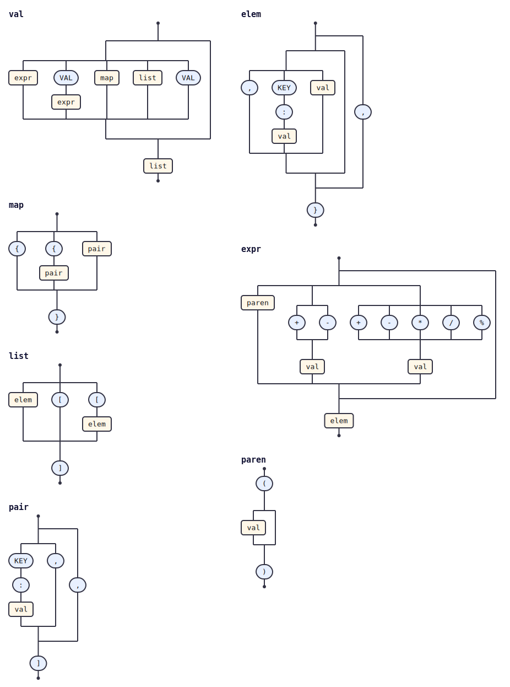

# @tabnas/expr

An expression-syntax plugin for the [Tabnas](https://github.com/tabnas/jsonic)
JSON parser, available in both TypeScript and Go.

It adds Pratt-parser expressions to Tabnas: infix, prefix, suffix, ternary,
and paren operators with a configurable binding-power (precedence) scale, so
values can include arithmetic, logical, and other expression syntax.
Expressions parse into LISP-style S-expressions (arrays whose first element
is the operator), which a user-supplied evaluator can reduce to values.

This repository contains:

| Path | Description |
|---|---|
| [`ts/`](ts/) | TypeScript / JavaScript implementation (canonical). |
| [`go/`](go/) | Go port. |
| [`test/spec/`](test/spec/) | Shared conformance fixtures, exercised by both runtimes. |

## Tiny example

```js
const { Tabnas } = require('@tabnas/parser')
const { jsonic } = require('@tabnas/jsonic')
const { Expr } = require('@tabnas/expr')

const j = new Tabnas().use(jsonic).use(Expr, {
  evaluate: (rule, ctx, op, terms) => {
    switch (op.src) {
      case '+': return op.prefix ? +terms[0] : terms[0] + terms[1]
      case '*': return terms[0] * terms[1]
      case '(': return terms[0]
      default:  return NaN
    }
  },
})

j.parse('1+2*3')     // => 7
j.parse('(1+2)*3')   // => 9
```

## Documentation

Docs follow the [Diátaxis](https://diataxis.fr) framework.

TypeScript (canonical):

- [Tutorial](ts/doc/tutorial.md) — parse and evaluate your first expression.
- [Guide](ts/doc/guide.md) — recipes: custom operators, function calls,
  ternaries, strict math.
- [Reference](ts/doc/reference.md) — exports, `OpDef` options, types, the
  default operator table.
- [Concepts](ts/doc/concepts.md) — Pratt parsing, the binding-power scale,
  design trade-offs.

Go port:

- [Tutorial](go/doc/tutorial.md) ·
  [Guide](go/doc/guide.md) ·
  [Reference](go/doc/reference.md) ·
  [Concepts](go/doc/concepts.md)

## Grammar diagram

The grammar as a railroad/syntax diagram, generated from the live grammar
with [`@tabnas/railroad`](https://github.com/tabnas/railroad):



ASCII version: [`ts/doc/grammar.txt`](ts/doc/grammar.txt).

## License

MIT. Copyright (c) Richard Rodger.
